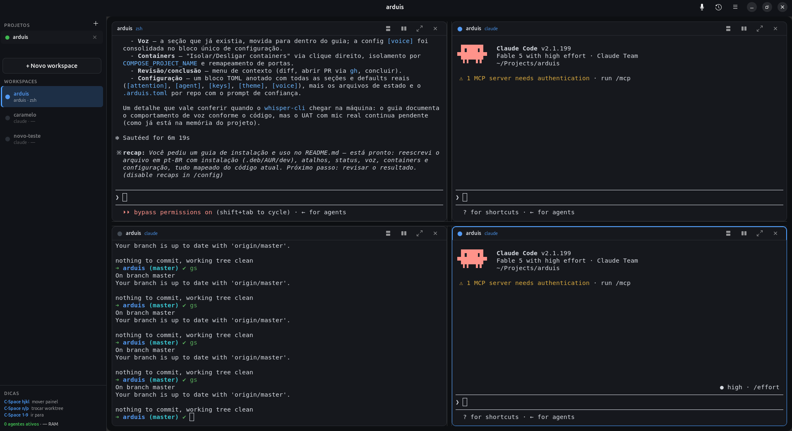

# arduis

arduis é um app desktop GNOME **lightweight** (Linux: Ubuntu + Arch) que orquestra
**vários agentes de IA (Claude Code) em paralelo** — cada um na sua **git worktree**, com
**terminais reais embutidos (VTE)**. É a resposta Linux e terminal-cêntrica ao.

**Core value:** tirar a ideia "quero começar uma branch nova" e ter um **agente de IA
rodando numa worktree isolada em segundos** — gerenciando N agentes em paralelo e
**sempre sabendo qual deles te espera**.



O app é 100% Python puro sobre a stack GNOME do **sistema** (PyGObject + GTK4 +
libadwaita + VTE-3.91). Usa o VTE da distro — **nunca** um bundlado ou instalado via
`pip` — e é distribuído **só como pacote nativo** no v1: `.deb` para Ubuntu e `PKGBUILD`
AUR para Arch. **Sem Flatpak e sem Snap** no v1 (Flatpak fica para o v2).

---

## Instalação

Os dois pacotes são wrappers finos sobre uma única definição de build
[meson](https://mesonbuild.com) (`meson.build`). O app é independente de arquitetura
(Python puro), então o `.deb` é `Architecture: all` e o pacote AUR é `arch=('any')`. As
dependências de runtime são as bibliotecas GNOME do **sistema** — instalar o pacote as
puxa junto; nada vem do `pip`.

> Publicação — subir o `PKGBUILD` para o AUR e hospedar o `.deb` num repo apt / PPA —
> fica para o **v1.1**. As instruções abaixo constroem e instalam os pacotes
> **localmente** a partir deste repositório.

### Ubuntu (`.deb`)

Verificado no Ubuntu 24.04 (o VTE GTK4 — `gir1.2-vte-3.91` 0.76 — está no `main`, sem
PPA).

```bash
# 1. Dependências de build (uma vez):
sudo apt install meson ninja-build debhelper

# 2. Construir o pacote a partir da raiz do repositório:
dpkg-buildpackage -us -uc -b
#    → produz ../arduis_1.0.0_all.deb

# 3. Instalar (o apt resolve as dependências de runtime):
sudo apt install ../arduis_1.0.0_all.deb
```

Dependências de runtime (declaradas em `debian/control`, instaladas automaticamente): o
VTE 0.76 do sistema (`gir1.2-vte-3.91` / `libvte-2.91-gtk4-0`), `python3-gi`,
`gir1.2-gtk-4.0`, `gir1.2-adw-1` e `python3` (>= 3.12). **Sem pip, sem Flatpak.**

Depois de instalar, `arduis` está no `PATH` e aparece na grade de apps do GNOME com seu
ícone.

### Arch (AUR)

Usa o `vte4` do sistema (0.84) e o resto da stack GNOME core.

```bash
# 1. Gerar o tarball de fonte a partir do repositório (até existir release publicado):
git archive --format=tar.gz --prefix=arduis-1.0.0/ -o arduis-1.0.0.tar.gz HEAD

# 2. Construir e instalar a partir do PKGBUILD (no diretório com PKGBUILD + tarball):
makepkg -si
```

Dependências de runtime (declaradas em `depends` do `PKGBUILD`, instaladas pelo pacman):
`python-gobject`, `gtk4`, `libadwaita`, `vte4`, `python`. O `PKGBUILD` **não tem
scriptlet `.install`** — hooks do pacman atualizam os caches de ícone e desktop-entry.

### Desenvolvimento

Não precisa instalar nada para hackear o arduis. Da raiz do repositório:

```bash
./run.sh          # ou: python3 src/main.py
```

`run.sh` é o launcher de dev; o `arduis` instalado (do `.deb` / pacote AUR) é o
equivalente para usuários finais. O diretório de onde você lança importa: o arduis
registra automaticamente o **projeto** do cwd (veja abaixo).

---

## Guia de uso

### Conceitos: projeto e workspace

- **Projeto** = uma pasta raiz cujos subdiretórios diretos com `.git` são os
  **repositórios membros** (modelo multi-repo / meta-repo). Um repo único dentro de uma
  pasta também funciona.
- **Workspace** = a unidade de trabalho: **um nome de branch** aplicado aos repos membros
  que você escolher. Cada workspace vive em git worktrees isoladas, agrupadas numa pasta
  irmã da raiz: `<raiz>-tasks/<branch>/`, com cada repo mantendo o nome do diretório
  original (paths relativos de compose/bind-mounts resolvem sem mudança).
- O arduis **nunca apaga nada do disco**. Concluir um workspace desliga processos e
  containers; as worktrees ficam para você remover quando quiser.

### Primeiros passos

1. Abra o arduis a partir da pasta do seu projeto (`cd ~/meu-projeto && arduis`), ou use
   o botão **"Abrir projeto"** (＋) na seção **PROJETOS** da sidebar.
2. No primeiro uso, o arduis oferece instalar os **hooks de status do Claude Code** em
   `~/.claude/settings.json` (merge aditivo, com backup). Aceite — é isso que faz o
   "quem espera por você" funcionar com precisão. Se recusar, um botão
   "status limitado — instalar hooks?" fica no rodapé da sidebar para reativar depois.
3. Clique em **"+ Novo workspace"**, digite o nome de uma branch (nova ou existente) e
   marque os repos membros que participam. **Criar** → o arduis cria as worktrees, abre
   o workspace com **dois terminais**: um **agente** já rodando `claude` em cima de um
   **shell** zsh normal, ambos na pasta do workspace.
4. Repita para quantas frentes de trabalho quiser. A sidebar lista os workspaces com um
   ponto de status cada — **laranja = esperando você**.

Workspaces existentes no disco (a pasta `-tasks`) são redescobertos a cada abertura como
**hibernados**; clique em **"Retomar workspace"** para religar (agentes Claude retomam a
sessão com `claude --continue`).

### Atalhos de teclado (estilo tmux)

Tudo passa por um **prefixo**: `Ctrl+Space`, depois uma tecla:

| Chord | Ação |
|---|---|
| `C-Space h/j/k/l` | Mover o foco entre painéis (esquerda/baixo/cima/direita) |
| `C-Space n` / `C-Space p` | Próximo / anterior workspace |
| `C-Space 1`–`9` | Ir direto para o N-ésimo workspace da sidebar |
| `C-Space -` | Dividir painel em cima/embaixo |
| `C-Space =` | Dividir painel lado a lado |
| `C-Space z` | Expandir/restaurar o painel focado (zoom) |
| `C-Space a` | Re-injetar o comando do agente no painel focado |
| `C-Space v` | Ligar/desligar o microfone (agente de voz) |

O prefixo é configurável (`[keys] prefix`, ex.: `"ctrl+b"`) e as teclas dos chords são
remapeáveis via `[keys.bindings]` — veja [Configuração](#configuração).

### Painéis (splits)

Cada terminal é um cartão com cabeçalho: ponto de status, branch, e botões de
**dividir em cima/embaixo**, **dividir lado a lado**, **expandir** (zoom) e **fechar**.
Os splits também existem como chords (tabela acima). Arraste os divisores para ajustar
as proporções — o layout (árvore de splits, proporções e foco) é **persistido por
workspace** e volta idêntico depois de reiniciar o app.

### Status: quem espera por você

Cinco estados por terminal, agregados por workspace na sidebar
(prioridade: waiting > running > ready > idle > ended):

| Cor | Estado | Significado |
|---|---|---|
| 🟠 laranja | **waiting** | O agente está **esperando você** (permissão, pergunta, escolha). O cartão inteiro ganha um anel laranja. |
| 🟢 verde | running | Agente trabalhando |
| 🔵 ciano | ready | Agente terminou o turno |
| ⚪ cinza-esverdeado | idle | Ready há mais de `idle_minutes` (default 10) |
| ⚫ cinza | ended / hibernado | Sessão encerrada ou workspace hibernado |

O sinal primário são os **hooks do Claude Code** (precisos e instantâneos); o texto do
terminal serve só como acelerador para diálogos de aprovação. Opcionais via
`[attention]`: notificação de desktop quando um agente entra em waiting com a janela
fora de foco (`notify_ready`), e auto-hibernação de workspaces ociosos
(`auto_suspend_minutes` — desligado por default; nunca mata agente rodando/esperando).
O rodapé mostra "N agentes ativos · RAM total".

### Agente de voz (opcional)

Botão de microfone no header (ou `C-Space v`): fale um prompt em inglês, fique em
silêncio ~1,5s e o arduis transcreve localmente (whisper.cpp), **cria um pane novo no
workspace ativo e roda `claude '<prompt>'` direto** (handsfree). Cada prompt falado fica
num histórico persistente (popover ao lado do mic) com replay de um clique.

Requisitos (a feature degrada com um toast se faltarem):

- GStreamer plugins-good (captura de microfone) — `gstreamer1.0-plugins-good` (Ubuntu) /
  `gst-plugins-good` (Arch)
- `whisper-cli` + um modelo ggml — Arch: `pacman -S whisper.cpp`; Ubuntu: compile o
  [whisper.cpp](https://github.com/ggml-org/whisper.cpp). Modelo:
  `curl -Lo ~/.local/share/arduis/models/ggml-base.en.bin https://huggingface.co/ggerganov/whisper.cpp/resolve/main/ggml-base.en.bin`

### Containers isolados (docker compose, opt-in)

Se o projeto tem um `docker-compose.yml` na raiz e `docker` está no `PATH`, o menu de
contexto do workspace (clique direito na sidebar) ganha **"Isolar containers"**: o arduis
sobe uma cópia completa do stack só para aquele workspace —
`COMPOSE_PROJECT_NAME` próprio (containers, rede e volumes separados; DB isolado de
graça) e **portas remapeadas automaticamente** (offset determinístico + sondagem de
porta livre), exibidas como badges `serviço:porta` no workspace.
**"Desligar containers"** (ou concluir o workspace) faz
`docker compose down --remove-orphans --volumes`.

### Revisão e conclusão

Clique direito num workspace na sidebar:

- **Ver diff** (geral ou por repo) — revise o que o agente fez
- **Abrir PR (web)** — via `gh`, no navegador
- **Retomar** / **Fechar repositório ▸** — gerenciar o que está aberto
- **Concluir workspace** — encerra processos e derruba os containers do workspace
  (worktrees ficam no disco; o arduis não apaga nada)

### Configuração

Arquivo do usuário: **`~/.config/arduis/arduis.toml`** — tudo opcional; valor inválido
cai no default, nunca quebra.

```toml
[attention]
auto_suspend_minutes = 0     # 0 = desligado; hiberna workspaces ociosos após N min
idle_minutes = 10            # ready → idle após N min
notify_ready = false         # notificação de desktop quando um agente entra em waiting
sound = false

[agent]
command = "claude"           # comando do agente injetado no shell (pode ter flags)

[keys]
prefix = "ctrl+space"        # só ctrl+<tecla> é suportado

[keys.bindings]              # remapear chords: tecla → nome de ação
# ações: focus_left focus_right focus_up focus_down worktree_next worktree_prev
#        split_v split_h zoom refeed_agent voice_toggle
# exemplo: "s" = "split_h"

[theme]
name = "parallel-dark"       # parallel-dark | dracula | nord | solarized-dark | gruvbox-dark
                             # (também pelo menu ☰ → Tema)

[voice]
command = "whisper-cli"                                   # binário (pode embutir flags)
model = "~/.local/share/arduis/models/ggml-base.en.bin"
language = "en"
silence_ms = 1500            # silêncio que encerra a fala
silence_threshold_db = -40.0 # limiar RMS de "falando"
max_seconds = 60             # teto de gravação
history_max = 200            # tamanho do histórico
```

Outros arquivos que o arduis mantém em `~/.config/arduis/`: `projects.json` (projetos
lembrados), `layouts.json` (layouts de painéis), `voice_history.json` (prompts falados),
`trusted_setups.toml` (veja abaixo). Estado de runtime fica em
`$XDG_RUNTIME_DIR/arduis/`.

### `.arduis.toml` por repositório (setup de worktree)

Cada repo membro pode commitar um `.arduis.toml` na sua raiz com comandos de setup que
rodam a cada worktree nova:

```toml
[setup]
commands = [
  "npm install",
  "cp .env.example .env",
]
```

Na primeira vez (e sempre que a lista mudar), o arduis mostra um prompt de confiança
antes de rodar — os comandos vêm do repositório, então rode-os só se confiar nele. A
aprovação fica registrada por hash em `~/.config/arduis/trusted_setups.toml`.
